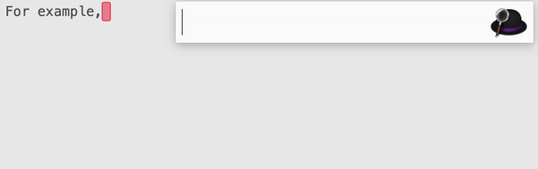

# Alfred-Unicodeit-Workflow

Built on [unicodeit](https://github.com/svenkreiss/unicodeit/); converts Latex or emoji into unicode right on Alfred; ready to be paste to the current text cursor.

[Download the workflow]().

## Usage
Converts keyboard with the keyword `uni`. Press `Enter` to copy it to the clipboard and paste into in the current cursor/application.

For example, E=mc² ☺

## Credits

- `unicodeit` module by [Sven Kreiss and Kyle Cranmere](https://github.com/svenkreiss/unicodeit/).
- `ChangeCase` workflow by [Jay Gillibrand](https://github.com/gillibrand/alfred-change-case)
